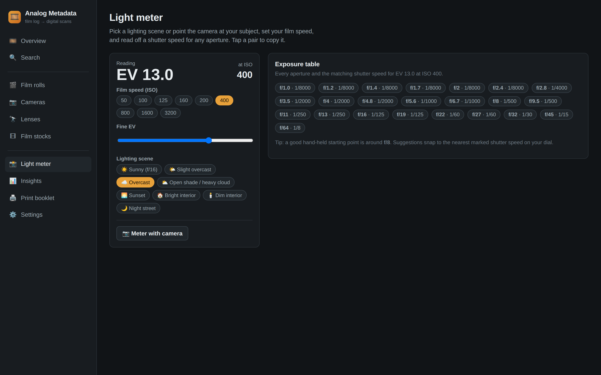
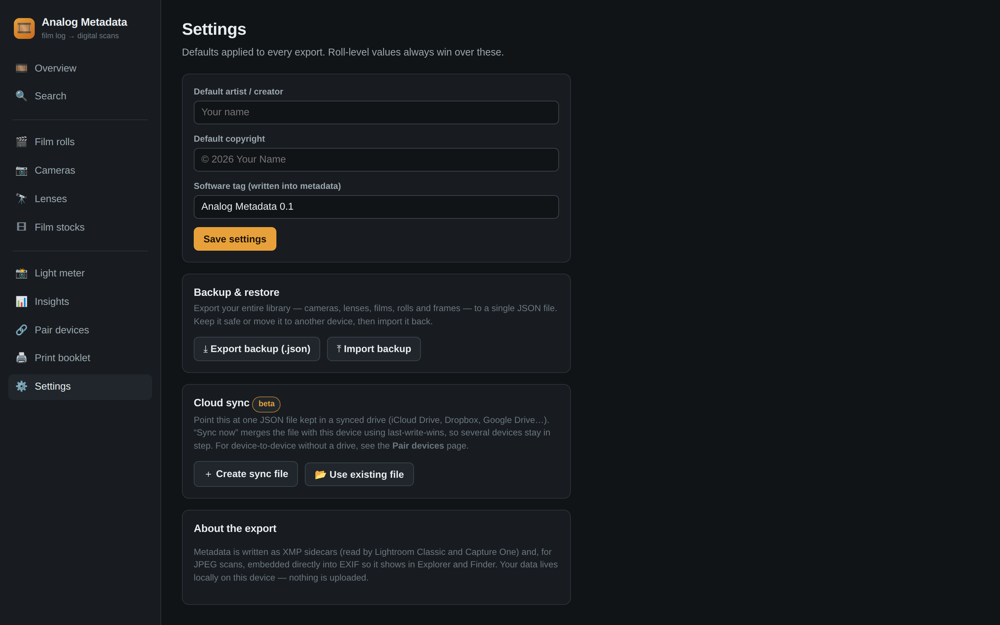
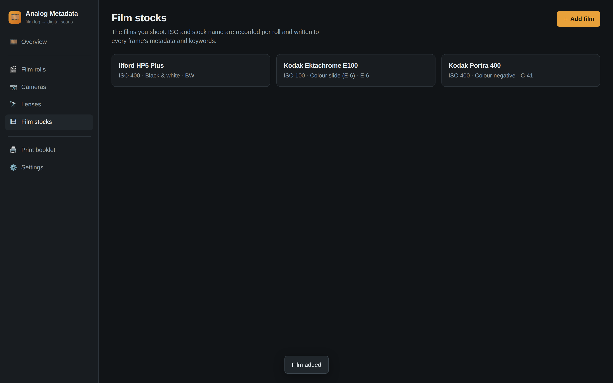
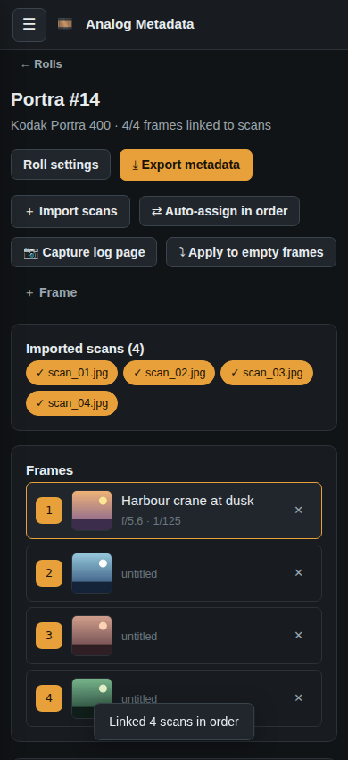

<div align="center">

# 🎞️ Analog Metadata

### Turn your handwritten film log into clean digital metadata

Bridge the notes from your analog logbook straight onto your scans — ready for
**Lightroom Classic**, **Capture One**, and **Windows Explorer / macOS Finder**.

**One codebase → iOS · Android · Windows · macOS** _(and any modern browser)_

<sub>React + TypeScript · local-first · no account, no upload</sub>

</div>

---

<div align="center">


<sub>The assignment workspace: your log-page photo on the left, one frame per exposure with auto-linked scan thumbnails, quick-pick aperture & shutter scales and weather chips on the right.</sub>

</div>

---

## The problem

Analog shooters keep a paper log. Some facts are noted once per **camera**
(make, model), some once per **roll** (film stock, ISO, push/pull, lab,
developer) and some per **frame** (aperture, shutter, lens, subject, weather,
date, location). **None of it survives the scan** — the scanner has no idea what
camera or lens you used.

**Analog Metadata is the bridge.** It captures that layered data the way a
logbook actually works, then writes it into the formats desktop photo apps
already understand.

> Shoot film → jot your settings on paper → scan the negatives → in the app,
> snap a photo of your log page, assign each handwritten row to its scan, and
> export XMP sidecars + embedded EXIF.

## What it does

- 📷 **Gear library** — cameras, lenses and a **45+ film-stock preset library**
  (Kodak, Ilford, Fuji, Cinestill, Lomography and more) as one-tap adds.
- 🎬 **Rolls & frames** — create a roll (camera + film + frame count) and it
  pre-creates one frame per exposure. Log each with quick-pick aperture and
  shutter scales, weather chips, lens, subject, keywords, date and GPS.
- ⚡ **Fast logging** — **copy the previous frame's** settings in one tap, or
  **apply one frame's exposure to every empty frame** at once.
- 📸 **Built-in light meter** — pick a lighting scene (or meter with the camera)
  and read a shutter speed for every aperture at your film speed. Tap to copy.
- 📍 **Location + retroactive weather** — the analog frame has no GPS or
  timestamp, so you type the place and the date & time; the app geocodes the
  place name to coordinates and fills the **historical** weather for that exact
  moment (via free, keyless services).
- 🖐️ **Capture the log page** — photograph your handwritten sheet with the
  device camera and keep it on-screen while you transcribe.
- 🔗 **Pair phone ⇆ desktop** — beam a log-page photo from your phone straight
  to the desktop over your local network via a QR handshake (WebRTC, no cloud).
- 🔗 **Assign scans intuitively** — import your scans, then **auto-assign in
  order** (scan 1 → frame 1 …) or link each by hand. Thumbnails show progress.
- 🔍 **Search & insights** — find any roll, frame or piece of gear by text, and
  see your most-shot films, cameras, lenses and apertures.
- ⤓ **Export the bridge** — XMP sidecars, embedded EXIF for JPEGs, a CSV and a
  READ-ME, zipped up.
- 💾 **Backup & restore** — export your whole library to one JSON file and
  import it on another device.
- ☁️ **Cloud sync** — point at one JSON file in any synced drive (iCloud Drive,
  Dropbox, Drive…); “Sync now” merges devices with last-write-wins.
- 🖨️ **Print your own logbook** — generate blank **DIN A6** log sheets as a PDF
  to carry with your camera.

Everything is **local-first** — your data lives on your device; nothing is
uploaded.

## Screenshots

| Overview | Roll workspace |
|---|---|
|  |  |

| Built-in light meter | Insights |
|---|---|
|  |  |

| Pair phone ⇆ desktop (WebRTC + QR) | Cloud sync & backup |
|---|---|
|  |  |

| Film stocks | Print DIN A6 booklet | Mobile |
|---|---|---|
|  |  |  |

## How your notes map to metadata

| Logbook field        | Level  | Written to                                                        |
|----------------------|--------|-------------------------------------------------------------------|
| Camera make / model  | camera | `tiff:Make` / `tiff:Model`, EXIF Make/Model                       |
| Lens                 | frame  | `exifEX:LensModel`, `aux:Lens` (Lightroom's Lens field)          |
| Aperture             | frame  | `exif:FNumber`                                                    |
| Shutter speed        | frame  | `exif:ExposureTime`                                               |
| Film ISO (+ push)    | roll   | `exif:ISOSpeedRatings`, keywords                                  |
| Focal length         | frame  | `exif:FocalLength`                                                |
| Subject / title      | frame  | `dc:title`, `photoshop:Headline`                                 |
| Description          | frame  | `dc:description`                                                  |
| Keywords + film + Wx | frame  | `dc:subject`                                                     |
| Date taken           | frame  | `xmp:CreateDate`, `photoshop:DateCreated`, `exif:DateTimeOriginal`|
| Location             | frame  | `Iptc4xmpCore:Location`                                          |
| GPS                  | frame  | `exif:GPSLatitude/Longitude`                                     |
| Artist / copyright   | roll   | `dc:creator` / `dc:rights`                                       |

The flattening rules live in one place: [`src/core/mapping.ts`](src/core/mapping.ts).

**Importing the export**
- **Lightroom Classic** — put the `.xmp` files next to their scans, then
  *Metadata ▸ Read Metadata from File* (or import the folder fresh).
- **Capture One** — reads sidecars on import; for imported images,
  *Image ▸ Metadata ▸ Load*.
- **Explorer / Finder** — use the JPEGs under `scans/`; metadata is inside them.

## Run it

```bash
npm install
npm run dev        # http://localhost:5173
npm run build      # type-check + production bundle into dist/
npm test           # unit tests (mapping, XMP, EXIF round-trip, ZIP, booklet)
```

## Build the native apps

The web app in `dist/` is wrapped natively by two toolchains — see
[`docs/ARCHITECTURE.md`](docs/ARCHITECTURE.md).

**Desktop — Windows & macOS (Tauri 2):** config in `src-tauri/`.

```bash
npm install -D @tauri-apps/cli
npx tauri icon path/to/logo.png
npx tauri dev            # run the desktop app
npx tauri build          # .dmg / .msi / .exe installers
```

**Mobile — iOS & Android (Capacitor):** config in `capacitor.config.ts`.

```bash
npm install @capacitor/core @capacitor/camera && npm install -D @capacitor/cli
npm run build
npx cap add ios && npx cap add android
npx cap sync
npx cap open ios | android   # run & sign in Xcode / Android Studio
```

## How it compares

There's a lively field of film-log apps. Here's an honest read of where we sit
and what they do that we don't yet.

| Capability | Analog Metadata | Frames | Pellica | EXIF Notes | Typical iOS logbooks |
|---|:---:|:---:|:---:|:---:|:---:|
| XMP sidecars (Lightroom **+** Capture One) | ✅ | ✅ | – | via ExifTool | rare |
| Embed EXIF into JPEG scans | ✅ | ✅ (also TIFF/DNG on Mac) | – | via ExifTool | rare |
| **Windows + macOS desktop app** | ✅ | Mac only | – | – | – |
| iOS + Android | ✅ (one codebase) | iOS | ✅ | Android | mostly iOS |
| **Print your own DIN A6 log booklets** | ✅ | – | – | – | – |
| Local-first / no account | ✅ | ✅ | partial | ✅ | varies |
| Built-in light meter | ✅ | – | ✅ | – | ✅ |
| Fast logging (copy / bulk-apply) | ✅ | ✅ | ✅ | – | some |
| Full JSON backup & restore | ✅ | – | – | – | rare |
| Global search & insights | ✅ | partial | ✅ | – | some |
| Large film-stock preset library | ✅ (45+) | ✅ (200+) | ✅ | – | some |
| Retroactive weather (place + date/time) | ✅ | – | live only | – | – |
| Cloud sync across devices | ✅ (file-based) | iCloud | Pro | – | iCloud |
| **Wireless device pairing, no cloud** | ✅ (WebRTC+QR) | – | – | – | – |
| DX / barcode frame decoding | ❌ | – | ✅ | – | – |
| Lab directory | ❌ | – | ✅ (1200+) | – | some |

**Where we already win:** true four-platform reach from a single codebase
(most rivals are iOS-only or mobile-only), a real Windows/macOS desktop app,
metadata that *both* Lightroom and Capture One read, a built-in light meter,
cloud sync **and** cable-free device pairing, and printable A6 booklets that
tie the paper and digital sides together.

### Recently shipped

Driven by user reviews of the competitors (see
[`docs/COMPARISON.md`](docs/COMPARISON.md)):

- ✅ **Built-in light meter** — scene presets + camera assist + exposure table
- ✅ **Fast logging** — copy-previous-frame and bulk apply-to-empty
- ✅ **45+ film-stock preset library**
- ✅ **Full JSON backup & restore** (the #1 "please add export" request)
- ✅ **Global search** across rolls, frames and gear
- ✅ **Insights** — most-used films, cameras, lenses and apertures
- ✅ **Cloud sync** — merge a JSON file kept in any synced drive (last-write-wins)
- ✅ **Wireless phone ⇆ desktop pairing** — WebRTC + QR, no cloud, no cable
- ✅ **Manual location + retroactive weather** — geocode a place name, then fill
  the historical weather for the frame's own date & time

### Still on the roadmap

1. **Write EXIF into TIFF / DNG directly** — bundle ExifTool in the Tauri
   desktop build so any scan format gets embedded metadata, not just JPEG.
2. **DX / edge-barcode decoding** — photograph the film rebate to auto-assign.
3. **Printed-booklet QR tie-in** — stamp each printed A6 sheet with a QR code
   that re-links it to its roll when you photograph it back in.
4. **Shooting calculators** — depth-of-field / hyperfocal, reciprocity timers.
5. **Real-time sync** — a hosted relay for automatic multi-device sync.

## Tech

React + TypeScript + Vite · Dexie (IndexedDB) · pdf-lib (booklet PDFs) ·
piexifjs (EXIF embedding) · a hand-rolled XMP writer for Lightroom/Capture One
interop · WebRTC + qrcode/jsQR for pairing · File System Access API for sync ·
Open-Meteo geocoding + historical-weather APIs · Tauri 2 (desktop) + Capacitor
(mobile) shells.

## Status

Core is implemented and tested end-to-end — **68 unit tests** (parsing, XMP,
EXIF write→read round-trip, ZIP bundle, booklet PDF, exposure maths, backup +
last-write-wins sync merge, search, stats, weather mapping and pairing
chunk/transfer) plus a real-browser smoke that seeds a library, generates a live
WebRTC pairing offer/QR and exercises meter, search, insights and sync. The
screenshots above are captured headlessly from that build.

**Beta:** device pairing and cloud sync work but are new — pairing needs both
devices on the same network and does a two-step QR/paste handshake; one-tap
cloud sync needs the File System Access API (Chromium desktop / the desktop app)
and falls back to export + merge-import elsewhere. Location is entered by hand
(or geocoded from a place name) and the weather is looked up retroactively for
the frame's own place, date and time via Open-Meteo — never the device's
current position, which an analog frame doesn't have.
