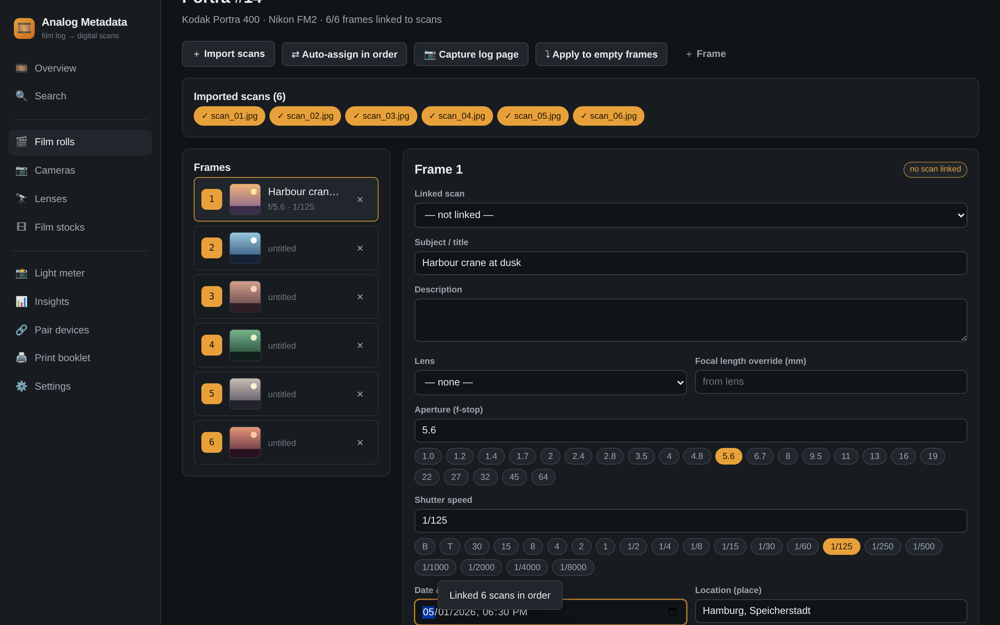
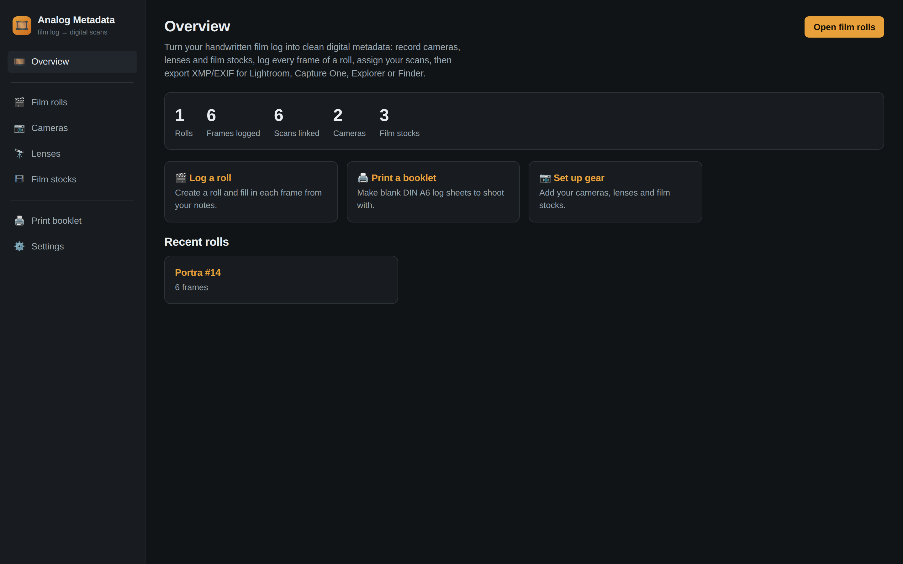
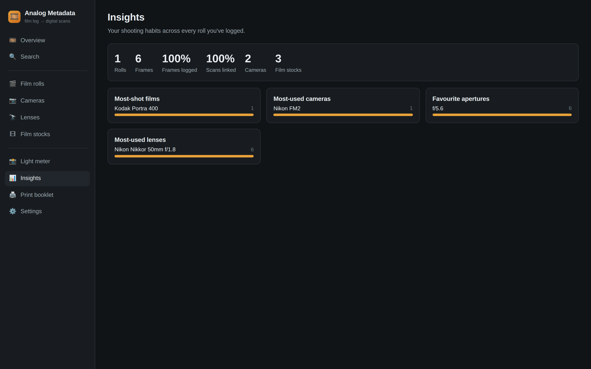
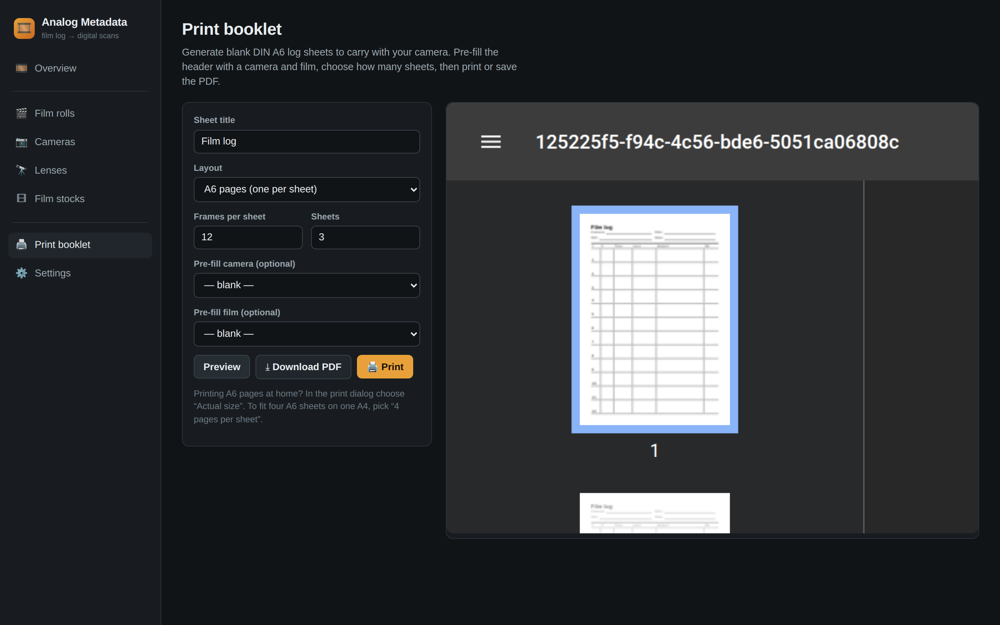
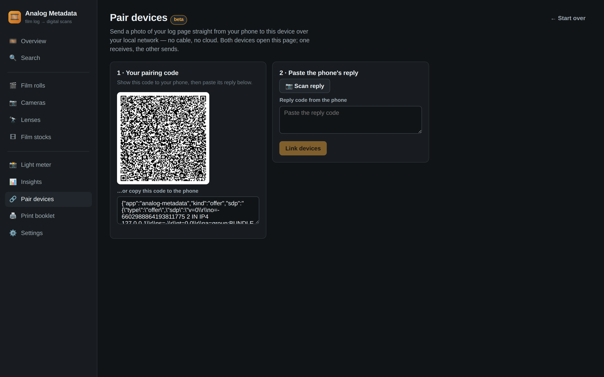
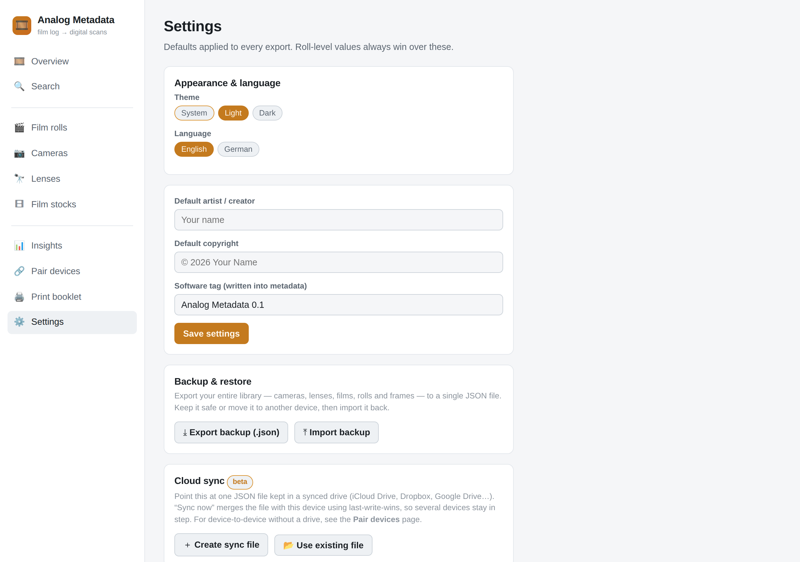
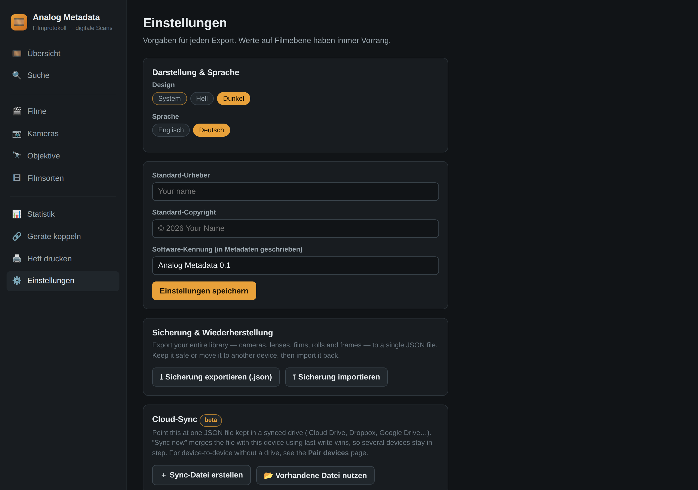
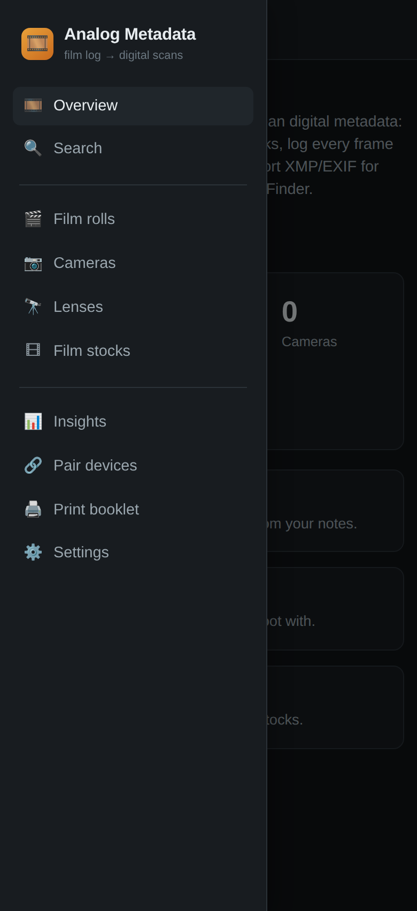

<div align="center">

# 🎞️ Analog Metadata

**Your handwritten film log, on your digital scans.**

Print log sheets → shoot → photograph the filled sheet → the app reads it back
and writes proper metadata onto your scans, ready for **Lightroom**,
**Capture One** and **Explorer / Finder**.

**iOS · Android · Windows · macOS** — one codebase, local-first, no account.

</div>



---

## Why

A scanner has no idea what camera, lens or aperture you used — that lives on
paper. Analog Metadata is the bridge: it records the log the way a real logbook
works (per camera, per roll, per frame) and writes it into the formats desktop
photo apps already read.

## What it does

- 📖 **Log rolls & frames** — cameras, lenses and 45+ film-stock presets;
  quick-pick aperture/shutter scales, weather chips, subject, keywords.
- 🖨️ **Print your own log sheets** — A6 / A5 / A4 / Letter, or 2×A6 folded on
  A4. Sheets printed for a roll carry a **QR back-link** to reopen it.
- 🔤 **Handwriting OCR** *(beta)* — photograph the filled sheet and it reads all
  six columns into per-frame suggestions you review before applying. Recognition
  runs **on your device — the photo is never uploaded** (the OCR engine itself is
  fetched from a CDN on first use, then cached).
- 🔗 **Assign scans** — import scans, auto-assign in order or link by hand.
- ⤓ **Export** — XMP sidecars (Lightroom + Capture One), EXIF embedded into JPEG
  scans (Explorer / Finder), plus CSV — zipped with import instructions.
- 📍 **Retroactive weather** — type the place and the date & time; the app
  geocodes it and looks up the *historical* weather for that moment.
- ☁️ **Sync & pair** — merge a JSON file in any synced drive, or beam a log-page
  photo phone→desktop over your local network (WebRTC + QR, no cloud).
- 🔍 **Search & insights**, 💾 **full JSON backup**, 🌗 **light/dark**,
  🌍 **English / German**.

## Screenshots

| Overview | Insights |
|---|---|
|  |  |

| Print booklet | Pair devices |
|---|---|
|  |  |

| Light theme | German UI | Mobile |
|---|---|---|
|  |  |  |

## Getting your notes into Lightroom / Capture One

Export a roll and you get one `scan_001.xmp` per scan. Put the sidecars next to
their scans, then:

- **Lightroom Classic** — *Metadata ▸ Read Metadata from File*
- **Capture One** — read on import, or *Image ▸ Metadata ▸ Load*
- **Explorer / Finder** — use the JPEGs in `scans/`; the data is inside the file

Full field-by-field mapping: [`docs/ARCHITECTURE.md`](docs/ARCHITECTURE.md).

## Run it

```bash
npm install
npm run dev     # http://localhost:5173
npm test        # unit tests
npm run build   # type-check + production bundle
```

**Native apps** — desktop via Tauri 2 (`src-tauri/`), mobile via Capacitor
(`capacitor.config.ts`):

```bash
# desktop (Windows / macOS)
npm i -D @tauri-apps/cli && npx tauri dev

# mobile (iOS / Android)
npm i @capacitor/core @capacitor/camera && npm i -D @capacitor/cli
npm run build && npx cap sync
npx cap open ios      # or: npx cap open android
```

Publishing a GitHub Release builds Windows, macOS, Android and iOS automatically
([`.github/workflows/release.yml`](.github/workflows/release.yml)).

## Status

Working and tested: **96 unit tests** plus headless end-to-end runs in which the
*exported files* are validated — XMP parsed as XML, EXIF read back out of the
JPEG. The UI is responsive from 390 px up. See
[`docs/ARCHITECTURE.md`](docs/ARCHITECTURE.md) for how it's built,
[`docs/SECURITY.md`](docs/SECURITY.md) for the security/readiness audit, and
[`docs/COMPARISON.md`](docs/COMPARISON.md) for how it compares to other film-log
apps.

**Beta caveats.** Handwriting OCR is best-effort — hence the review step; it
likes straight, well-lit photos and neat block capitals. One-tap cloud sync needs
the File System Access API (Chromium desktop / the desktop app) and falls back to
export + merge-import elsewhere. Device pairing needs both devices on the same
network.

**Roadmap:** EXIF straight into TIFF/DNG (bundled ExifTool), DX barcode decoding,
shooting calculators, more languages.

## Tech

React · TypeScript · Vite · Dexie (IndexedDB) · pdf-lib · piexifjs ·
Tesseract.js · WebRTC · Open-Meteo · Tauri 2 · Capacitor
